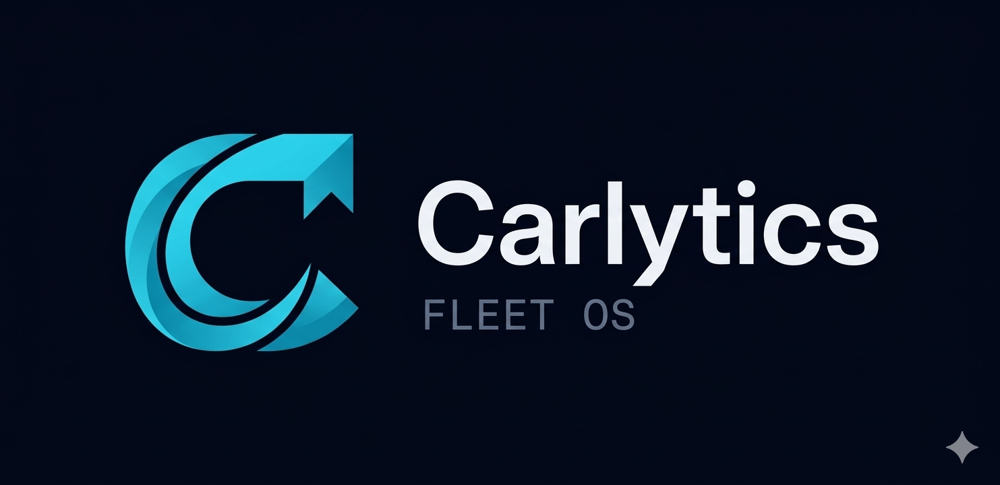

# 🚗 Carlytics

A real-time, event-driven fleet management platform built with modern full-stack architecture.

Carlytics centralizes vehicles, assignments, fuel logs, service history, incidents, employees, and operational activity into one role-aware Fleet OS.


**🔴 Live Demo:** [carlytics-zeta.vercel.app](https://carlytics-zeta.vercel.app/)  
**🟢 Tech:** Next.js • TypeScript • Supabase • PostgreSQL • Tailwind CSS

## 📸 Preview



> Real-time dashboard with live fleet updates, service alerts, and centralized activity stream.

## 🚀 Highlights

### Real-time System

- Supabase Realtime subscriptions
- UI updates without full page reloads
- Source-table filtering for targeted refreshes

### Backend Design

- PostgreSQL triggers for operational events
- Centralized event stream in `app_events`
- Persistent activity log for system changes

### Product Workflow

- Desktop Fleet OS for administrators and fleet managers
- Mobile-first workflow for field employees
- Role-aware routing and protected routes

## 🧩 Problem

Fleet operations often spread vehicle data, service history, assignments, fuel logs, and incident reports across multiple tools. That makes it difficult to react quickly, track operational history, and keep teams synchronized in real time.

## 💡 Solution

Carlytics centralizes all fleet-related data into one operational platform. Database triggers convert important changes into events, Supabase Realtime streams those events to the frontend, and the UI refreshes affected views without requiring full page reloads.

## ⚙️ Features

- Vehicle management and digital vehicle profiles
- Active and historical vehicle assignments
- Service, maintenance, registration, and tire history
- Fuel tracking with cost analytics
- Fault/incident reporting with image attachments
- Employee management and invitation-based onboarding
- Role-based desktop and mobile workflows
- Real-time dashboard, fleet, fuel, assignment, employee, and service updates

## 🏗 Architecture

The system follows an event-driven architecture:

- PostgreSQL triggers detect operational changes
- Trigger function writes normalized events into `app_events`
- Frontend subscribes to `app_events` using Supabase Realtime
- Live refresh hooks filter events by source table
- Lightweight API routes reload only the affected page data

This approach reduces frontend complexity, minimizes duplicated realtime logic, and creates a persistent audit trail of important system activity.

```mermaid
flowchart LR
  A[Domain tables] --> B[PostgreSQL triggers]
  B --> C[app_events]
  C --> D[Supabase Realtime]
  D --> E[LiveUpdatesProvider]
  E --> F[/api/live endpoints]
  F --> G[Updated UI views]
```

Main event sources include:

- `vozila`
- `zaduzenja`
- `evidencija_goriva`
- `servisne_intervencije`
- `registracije`
- `zaposlenici`

## 🛠 Tech Stack

Next.js • React • TypeScript • Supabase PostgreSQL • Supabase Realtime • Supabase Storage • NextAuth • Tailwind CSS • Zod • Chart.js • Vercel

## 🚀 Getting Started

### 1. Clone Repository

```bash
git clone https://github.com/petarkrvavac/Carlytics.git
cd Carlytics
```

### 2. Install Dependencies

```bash
npm install
```

### 3. Setup Environment Variables

Create `.env.local` in the project root. You can use `.env.example` as a template:

```env
NEXT_PUBLIC_SUPABASE_URL=https://your-project.supabase.co
NEXT_PUBLIC_SUPABASE_ANON_KEY=your-supabase-anon-key
SUPABASE_SERVICE_ROLE_KEY=your-supabase-service-role-key

NEXTAUTH_URL=http://localhost:3000
NEXTAUTH_SECRET=generate-a-long-random-secret

SUPABASE_PROJECT_ID=your-supabase-project-id
```

### 4. Import Database

Import the provided PostgreSQL dump before running the app:

> Requires PostgreSQL installed locally.

```bash
createdb carlytics
psql -d carlytics -f database-sql/database.sql
```

For Supabase, import `database-sql/database.sql` into a fresh project through the SQL editor or a direct `psql` connection.

### 5. Run Development Server

```bash
npm run dev
```

Open:

```text
http://localhost:3000
```

## 🔐 Environment Variables

| Variable | Description |
| --- | --- |
| `NEXT_PUBLIC_SUPABASE_URL` | Supabase project URL |
| `NEXT_PUBLIC_SUPABASE_ANON_KEY` | Public anon key used by the client and realtime subscription |
| `SUPABASE_SERVICE_ROLE_KEY` | Server-side key used for privileged reads/writes while RLS is enabled |
| `NEXTAUTH_URL` | Base URL used by NextAuth |
| `NEXTAUTH_SECRET` | Secret used to sign JWT sessions |
| `SUPABASE_PROJECT_ID` | Supabase project id used for type generation |

## 🗄 Database Setup

The database schema and seed data are provided in:

```text
database-sql/database.sql
```

The dump includes:

- PostgreSQL tables, relationships, constraints, indexes, and sequences
- Seed data for vehicles, employees, assignments, fuel, service history, roles, and lookup tables
- `emit_app_event()` trigger function
- Triggers for fuel entries, assignments, and service interventions
- `app_events` table used by the realtime refresh system
- RLS enabled on application tables

After importing the database, create a Supabase Storage bucket named:

```text
kvarovi
```

This bucket is used for uploaded fault/incident images. If realtime updates do not appear, enable realtime replication for the `app_events` table in Supabase.

### Demo Accounts

| Role | Username | Password |
| --- | --- | --- |
| Administrator | `seed.admin01` | `Test1234!` |
| Fleet manager | `seed.voditelj01` | `Test1234!` |
| Employee | `seed.radnik01` | `Test1234!` |

## 🔮 Future Improvements

- Automatic VIN-based vehicle detection
- Advanced analytics and exportable fleet reports
- More granular RLS policies for user-scoped database access
- Automated email delivery for employee invitations
- PWA/offline support for field employees

## 👤 Author

**Petar Krvavac**  
Computer Science Student @ FSRE Mostar

- GitHub: [petarkrvavac](https://github.com/petarkrvavac)
- Repository: [Carlytics](https://github.com/petarkrvavac/Carlytics)

## 📄 License


This project is licensed under the **MIT License**.  
See the [LICENSE](./LICENSE) file for details.
