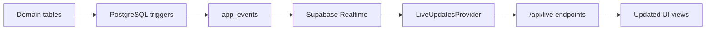

# Carlytics

A real-time, event-driven fleet management platform built with modern full-stack architecture.

Carlytics centralizes vehicles, assignments, fuel logs, service history, incidents, employees, and operational activity into one role-aware Fleet OS.


**🔴 Live Demo:** [carlytics-zeta.vercel.app](https://carlytics-zeta.vercel.app/)  
**🟢 Tech:** Next.js • TypeScript • Supabase • PostgreSQL • Tailwind CSS

## Preview


> Real-time dashboard with live fleet updates, service alerts, and centralized activity stream.

## Overview

Fleet operations often spread vehicle data, service history, assignments, fuel logs, and incident reports across multiple tools, making it difficult to react quickly and keep teams synchronized in real time.

Carlytics solves this by centralizing all fleet-related data into one operational platform. PostgreSQL triggers detect important changes and convert them into normalized events, which Supabase Realtime streams to the frontend. This enables live UI updates without full page reloads, creating both a responsive user experience and a persistent audit trail.

The result is an event-driven, role-aware Fleet OS that supports desktop workflows for administrators and fleet managers, alongside mobile-first tools for field employees.

## Architecture

The system follows an event-driven, trigger-based architecture:

- PostgreSQL triggers detect operational changes
- Trigger function writes normalized events into `app_events`
- Frontend subscribes to `app_events` using Supabase Realtime
- Live refresh hooks filter events by source table
- Lightweight API endpoints and realtime hooks refresh only affected UI sections

This approach reduces frontend complexity, minimizes duplicated realtime logic, and creates a persistent audit trail of important system activity.



Main event sources include:

- `vozila`
- `zaduzenja`
- `evidencija_goriva`
- `servisne_intervencije`
- `registracije`
- `zaposlenici`

## Key Features

- **Vehicle Management** — Digital vehicle profiles with cost tracking and status monitoring
- **Assignments** — Active and historical vehicle assignments with real-time updates
- **Service History** — Maintenance, registration, and tire service records
- **Fuel Tracking** — Comprehensive fuel logs with cost analytics
- **Incident Reporting** — Fault reporting with image attachments
- **Reports** — CSV and print/PDF-friendly fleet, service, and fuel reports
- **Employee Management** — Team management with invitation-based onboarding
- **Role-based Workflows** — Desktop OS for administrators, mobile-first tools for field employees
- **Real-time Dashboard** — Live fleet updates, service alerts, and centralized activity stream

## Tech Stack

| Layer | Technology |
|-------|-----------|
| **Frontend** | Next.js 16+, React, TypeScript |
| **Styling** | Tailwind CSS v4 |
| **Backend** | Supabase PostgreSQL |
| **Authentication** | NextAuth |
| **Real-time** | Supabase Realtime |
| **Storage** | Supabase Storage |
| **Validation** | Zod |
| **Charts** | Chart.js |
| **Deployment** | Vercel |

## Getting Started

### 1. Clone Repository

```bash
git clone https://github.com/petarkrvavac/Carlytics.git
cd Carlytics
```

### 2. Install Dependencies

```bash
npm install
```

### 3. Setup Database

Import the provided SQL dump into PostgreSQL or Supabase:

```bash
createdb carlytics
psql -d carlytics -f database-sql/database.sql
```

The dump includes:
- Complete schema with tables, relationships, and indexes
- Seed data for vehicles, employees, assignments, and more
- PostgreSQL triggers for the event system
- RLS (Row-Level Security) policies

### 4. Configure Supabase

The realtime features (live dashboard, real-time updates) require Supabase. Create `.env.local` in the project root:

```env
# Supabase Configuration (Required for realtime)
NEXT_PUBLIC_SUPABASE_URL=https://your-project.supabase.co
NEXT_PUBLIC_SUPABASE_ANON_KEY=your-supabase-anon-key
SUPABASE_SERVICE_ROLE_KEY=your-supabase-service-role-key
SUPABASE_PROJECT_ID=your-supabase-project-id

# NextAuth Configuration
NEXTAUTH_URL=http://localhost:3000
NEXTAUTH_SECRET=generate-a-long-random-secret-here
```

> **Important:** Upload your PostgreSQL database to Supabase and enable realtime replication on the `app_events` table for live features to work.

### 5. Run Development Server

```bash
npm run dev
```

Open [http://localhost:3000](http://localhost:3000)

## Demo Accounts

Once the database is imported, use these credentials to test different roles:

| Role | Username | Password |
| --- | --- | --- |
| Administrator | `seed.admin01` | `Test1234!` |
| Fleet manager | `seed.voditelj01` | `Test1234!` |
| Employee | `seed.radnik01` | `Test1234!` |

## Project Structure

```
src/
├── app/              # Routes and API endpoints
├── components/       # Reusable UI components
├── lib/              # Server actions and utilities
├── hooks/            # Custom hooks
├── types/            # TypeScript types
database-sql/
docs/
public/
```

## Design Decisions

- **Event-driven Architecture** — PostgreSQL triggers write normalized events into `app_events`, while Supabase Realtime streams changes to the frontend.

- **Trigger-based Events** — A single trigger function centralizes realtime logic and reduces frontend complexity.

- **Role-based Routing** — Desktop and mobile workflows are separated and protected through middleware and server actions.

- **Soft Deletes & Audit Trail** — Historical data is preserved and operational events are stored permanently.

- **Supabase Storage** — Images are stored outside the database for better scalability.

- **SSR & Streaming** — Initial content is server-rendered and progressively streamed with React Suspense.

## Future Improvements

- Automatic VIN-based vehicle detection
- Scheduled report delivery and deeper forecast analytics
- More granular RLS policies for user-scoped database access
- Automated email delivery for employee invitations
- PWA/offline support for field employees

## Author

**Petar Krvavac**  
Computer Science Student @ FSRE Mostar

## License


This project is licensed under the **MIT License**.  
See the [LICENSE](./LICENSE) file for details.
